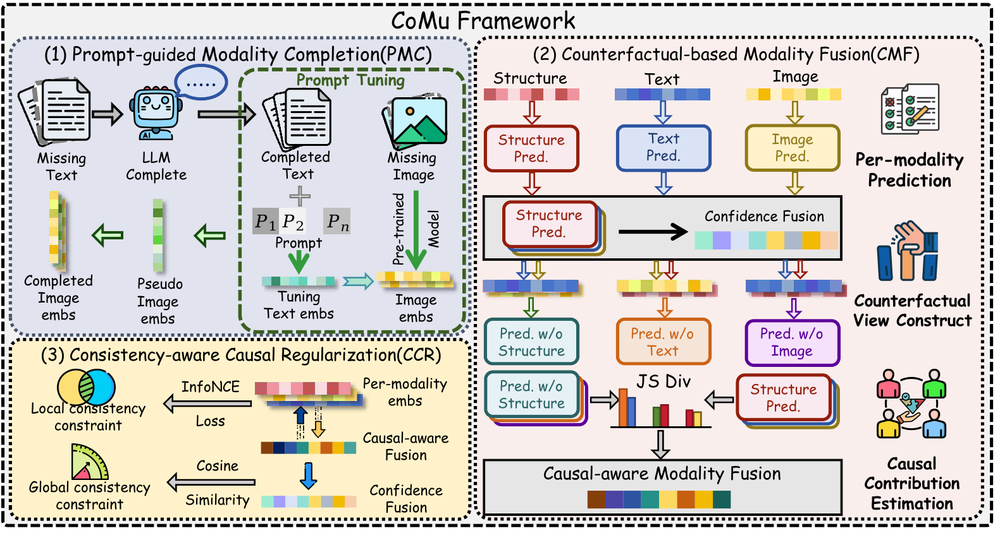

# CoMu

Official implementation of **CoMu**, a counterfactual-based multimodal fusion framework for multimodal knowledge graph completion.

## Overview

<p align="center">
  <a href="./figures/comu_framework.pdf">
    
  </a>
</p>

CoMu contains three main components:

1. **Prompt-guided Modality Completion (PMC)** completes missing textual and visual information and aligns multimodal entity features.
2. **Counterfactual-based Modality Fusion (CMF)** estimates modality-level causal contributions through counterfactual interventions and performs causal-aware fusion.
3. **Consistency-aware Causal Regularization (CCR)** preserves global and local semantic consistency during causal-aware fusion.

Click the framework figure to open its vector PDF version.

## Code Structure
```sh
CoMu
├─ datasets
│  ├─ DB15K-tuning
│  ├─ MKG-W-tuning
│  └─ MKG-Y-tuning
├─ layers
│  ├─ __init__.py
│  └─ layer.py
├─ models
│  ├─ __init__.py
│  ├─ model.py
│  └─ CoMu.py
├─ utils
│  ├─ __init__.py
│  ├─ data_loader.py
│  └─ data_util.py
├─ CoMu.yml
├─ README.md
├─ run.sh
└─ train.py
```

## Data
Please download the structural data and multimodal features from:
[Google Drive](https://drive.google.com/drive/folders/1mjQbTu9Yse9i60sXddhH8ONt3GDH_wbJ?usp=sharing)

After downloading, place them in:
`datasets/DB15K-tuning`, `datasets/MKG-W-tuning`, and `datasets/MKG-Y-tuning`.

## Dependency
Create the environment from the project directory:
```sh
conda env create -f CoMu.yml -n CoMu
conda activate CoMu
```

## Train
Run the main experiments:
```sh
bash run.sh
```

Or run a single dataset:
**DB15K-tuning**
```sh
python -u train.py --cuda 0 --lr 0.001 --eval_freq 25 --dim 200 --dataset DB15K-tuning --epochs 500 --lamda_l 1e-5 --lamda_g 1e-5
```

**MKG-W-tuning**
```sh
python -u train.py --cuda 0 --lr 0.001 --eval_freq 25 --dim 200 --dataset MKG-W-tuning --epochs 500 --lamda_l 5e-5 --lamda_g 1e-4
```

**MKG-Y-tuning**
```sh
python -u train.py --cuda 0 --lr 0.001 --eval_freq 25 --dim 200 --dataset MKG-Y-tuning --epochs 500 --lamda_l 5e-4 --lamda_g 1e-6
```
